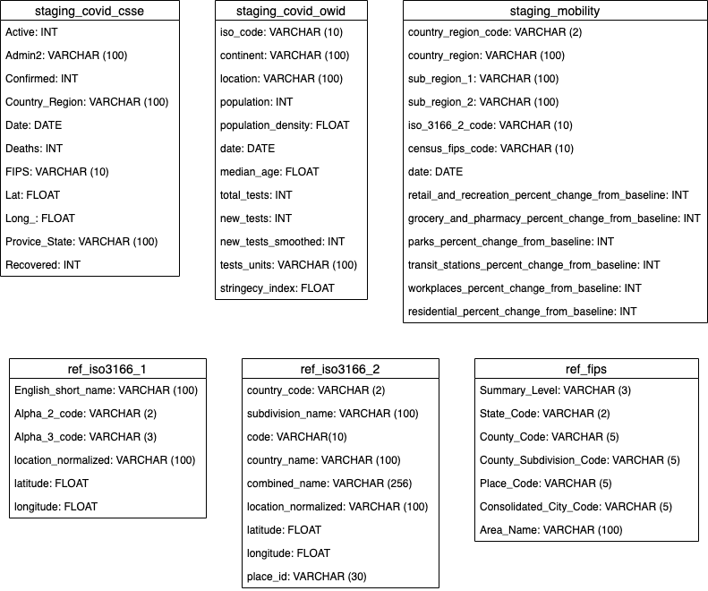

# Fictional Project Scope
A fictional research institute plans to analyze the impact of the COVID-19 pandemic on the Air quality.
To achieve that they have the following data sources available:
- COVID-19 Data Repository by the Center for Systems Science and Engineering (CSSE) at Johns Hopkins University
- COVID-19 Dataset from Our World in Data
- Google Mobility Data
- Worldwide COVID-19 dataset from the Air Quality Open Data Platform

They plan to combine these datasets according to answer specific questions on how COVID-19, Air quality and Mobility developed over time and / or in specific countries / regions during the pandemic. It should be possible to look at these topics individually but also to put them into relation. For this they contracted you as Data Engineer - they want you to build up a proper data model and perform the needed ETL operations with the target to prepare the data within Amazon Redshift for further analysis.

# Data Exploration

## COVID-19 Data Repository by the Center for Systems Science and Engineering (CSSE) at Johns Hopkins University

### File Format & Structure
The dataset is provided as either daily reports or time series summary. The daily reports are available worldwide or for US only. All files are provided in CSV format. For the project scope only the worldwide daily reports will be considered. These daily reports are delivered as single files per day with the following naming convention: `MM-DD-YYYY.csv` in UTC.

### Field description
Column|Description
------|-----------
`FIPS`|US only. Federal Information Processing Standards code that uniquely identifies counties within the USA.
`Admin2`|County name. US only.
`Province_State`|Province, state or dependency name.
`Country_Region`|Country, region or sovereignty name. The names of locations included on the Website correspond with the official designations used by the U.S. Department of State.
`Last_Update`|MM/DD/YYYY HH:mm:ss  (24 hour format, in UTC).
`Lat` and `Long_`|Dot locations on the dashboard. All points (except for Australia) shown on the map are based on geographic centroids, and are not representative of a specific address, building or any location at a spatial scale finer than a province/state. Australian dots are located at the centroid of the largest city in each state.
`Confirmed`|Confirmed cases include presumptive positive cases  and probable cases, in accordance with CDC guidelines as of April 14.
`Deaths`|Death totals in the US include confirmed and probable, in accordance with [CDC](https://www.cdc.gov/coronavirus/2019-ncov/cases-updates/cases-in-us.html) guidelines as of April 14.
`Recovered`|Recovered cases outside China are estimates based on local media reports, and state and local reporting when available, and therefore may be substantially lower than the true number. US state-level recovered cases are from [COVID Tracking Project](https://covidtracking.com/).
`Active`|Active cases = total confirmed - total recovered - total deaths.
`Combined_Key`|String concatenation of the fields `Admin2`, `Province_State` and `Country_Region`
`Incidence_Rate`|Confirmed cases per 100,000 persons.
`Case-Fatality_Ratio`|Percentage share of cases which ended deadly.

## COVID-19 Dataset from Our World in Data

### File Format & Structure
The dataset is available as Excel, CSV or JSON. To fulfill the project requirement of having at least two different data formats the JSON format version will be used. This dataset is provided as a single file in time series structure.

### Field description
Column|Description|Source
------|-----------|------
`iso_code`|ISO 3166-1 alpha-3 – three-letter country codes|International Organization for Standardization
`continent`|Continent of the geographical location|Our World in Data
`location`|Geographical location|Our World in Data
`date`|Date of observation|Our World in Data
`total_cases`|Total confirmed cases of COVID-19|European Centre for Disease Prevention and Control
`new_cases`|New confirmed cases of COVID-19|European Centre for Disease Prevention and Control
`total_deaths`|Total deaths attributed to COVID-19|European Centre for Disease Prevention and Control
`new_deaths`|New deaths attributed to COVID-19|European Centre for Disease Prevention and Control
`total_cases_per_million`|Total confirmed cases of COVID-19 per 1,000,000 people|European Centre for Disease Prevention and Control
`new_cases_per_million`|New confirmed cases of COVID-19 per 1,000,000 people|European Centre for Disease Prevention and Control
`total_deaths_per_million`|Total deaths attributed to COVID-19 per 1,000,000 people|European Centre for Disease Prevention and Control
`new_deaths_per_million`|New deaths attributed to COVID-19 per 1,000,000 people|European Centre for Disease Prevention and Control
`total_tests`|Total tests for COVID-19|National government reports
`new_tests`|New tests for COVID-19|National government reports
`new_tests_smoothed`|New tests for COVID-19 (7-day smoothed). For countries that don't report testing data on a daily basis, we assume that testing changed equally on a daily basis over any periods in which no data was reported. This produces a complete series of daily figures, which is then averaged over a rolling 7-day window|National government reports
`total_tests_per_thousand`|Total tests for COVID-19 per 1,000 people|National government reports
`new_tests_per_thousand`|New tests for COVID-19 per 1,000 people|National government reports
`new_tests_smoothed_per_thousand`|New tests for COVID-19 (7-day smoothed) per 1,000 people|National government reports
`tests_units`|Units used by the location to report its testing data|National government reports
`stringency_index`|Government Response Stringency Index: composite measure based on 9 response indicators including school closures, workplace closures, and travel bans, rescaled to a value from 0 to 100 (100 = strictest response)|Oxford COVID-19 Government Response Tracker, Blavatnik School of Government
`population`|Population in 2020|United Nations, Department of Economic and Social Affairs, Population Division, World Population Prospects: The 2019 Revision
`population_density`|Number of people divided by land area, measured in square kilometers, most recent year available|World Bank – World Development Indicators, sourced from Food and Agriculture Organization and World Bank estimates
`median_age`|Median age of the population, UN projection for 2020|UN Population Division, World Population Prospects, 2017 Revision
`aged_65_older`|Share of the population that is 65 years and older, most recent year available|World Bank – World Development Indicators, based on age/sex distributions of United Nations Population Division's World Population Prospects: 2017 Revision
`aged_70_older`|Share of the population that is 70 years and older in 2015|United Nations, Department of Economic and Social Affairs, Population Division (2017), World Population Prospects: The 2017 Revision
`gdp_per_capita`|Gross domestic product at purchasing power parity (constant 2011 international dollars), most recent year available|World Bank – World Development Indicators, source from World Bank, International Comparison Program database
`extreme_poverty`|Share of the population living in extreme poverty, most recent year available since 2010|World Bank – World Development Indicators, sourced from World Bank Development Research Group
`cvd_death_rate`|Death rate from cardiovascular disease in 2017|Global Burden of Disease Collaborative Network, Global Burden of Disease Study 2017 Results
`diabetes_prevalence`|Diabetes prevalence (% of population aged 20 to 79) in 2017|World Bank – World Development Indicators, sourced from International Diabetes Federation, Diabetes Atlas
`female_smokers`|Share of women who smoke, most recent year available|World Bank – World Development Indicators, sourced from World Health Organization, Global Health Observatory Data Repository
`male_smokers`|Share of men who smoke, most recent year available|World Bank – World Development Indicators, sourced from World Health Organization, Global Health Observatory Data Repository
`handwashing_facilities`|Share of the population with basic handwashing facilities on premises, most recent year available|United Nations Statistics Division
`hospital_beds_per_thousand`|Hospital beds per 1,000 people, most recent year available since 2010|OECD, Eurostat, World Bank, national government records and other sources
`life_expectancy`|Life expectancy at birth in 2019|James C. Riley, Clio Infra, United Nations Population Division

## Google Mobility Data

### File Format & Structure
The dataset is provided as single CSV file in time series structure.

### Field description
Column|Description
------|-----------
`country_region_code`|ISO 3166-1 country code (2 character variant).
`country_region`|Country name.
`sub_region_1`|possible principal subdivision (e.g. provinces or states).
`sub_region_2`|possible principal subdivision (e.g. provinces or states).
`iso_3166_2_code`|ISO codes for identifying the principal subdivisions (e.g. provinces or states) of all countries coded in ISO 3166-1.
`census_fips_code`|US only. Federal Information Processing Standards code that uniquely identifies counties within the USA.
`date`|Date in MM-DD-YYYY format.
`retail_and_recreation_percent_change_from_baseline`|Mobility trends for places like restaurants, cafes, shopping centers, theme parks, museums, libraries, and movie theaters. Changes for each day are compared to a baseline value for that day of the week.
`grocery_and_pharmacy_percent_change_from_baseline`|Mobility trends for places like grocery markets, food warehouses, farmers markets, specialty food shops, drug stores, and pharmacies. Changes for each day are compared to a baseline value for that day of the week.
`parks_percent_change_from_baseline`|Mobility trends for places like local parks, national parks, public beaches, marinas, dog parks, plazas, and public gardens. Changes for each day are compared to a baseline value for that day of the week.
`transit_stations_percent_change_from_baseline`|Mobility trends for places like public transport hubs such as subway, bus, and train stations. Changes for each day are compared to a baseline value for that day of the week.
`workplaces_percent_change_from_baseline`|Mobility trends for places of work. Changes for each day are compared to a baseline value for that day of the week.
`residential_percent_change_from_baseline`|Mobility trends for residential places. Changes for each day are compared to a baseline value for that day of the week.

## Worldwide COVID-19 dataset from the Air Quality Open Data Platform

### File Format & Structure
The dataset is provided as single CSV file in time series structure.

### Field description
Column|Description
------|-----------
`Date`|Date in MM-DD-YYYY format. UTC based.
`Country`|ISO 3166-1 country code (2 character variant).
`City`|City Name
`Specie`|Type of data ranging from air pollutant species (PM2.5,PM10, Ozone ...) to meteorological data (Wind, Temperature, ...). All air pollutant species are converted to the US EPA standard (i.e. no raw concentrations).
`count`|Number of samples used for calculating the median and standard deviation
`min`|Min of all data samples
`max`|Max of all data samples
`median`|Median of all data samples
`variance`|Standard deviation of all data samples

# Data Model & Dictionary
## Dimensions
- Continent
- Country with ISO references
- State / Region (Country Sub 1)
- City (Country Sub 2)
- Time
- AQI_level

## Facts
### covid_cases
- serial id
- date
- confirmed_cases_jh
- confirmed_cases_ovid
- active_cases (= confirmed_cases - recovered_cases - deaths)
- recovered_cases
- deaths
- tests
- mortality_rate?
- survival_rate?

### covid_cases_aggregate (optional for query performance)
- aggregate cases on Continent / Country / ...
- aggregate cases on common time ranges

### AQI_measurements
- serial id
- Date
### Weather_events
### Mobility

# ETL & Architecture

## Prerequisite: Geolocation Normalization
In order to combine as much of the final data as possible based on location (country, region, city..) it is needed to have unique identifiers. Unfortunately not all source data tables are using the same standards like ISO or FIPS. Additionally the location names are not fully matching due to different notation or languages. To solve that problem I decided to introduce my own Reference Tables for the ISO Standards 3166-1 and 3166-2 which cover a wide range of countries and regions. To ensure a common naming and notation of location names I built a separate small ETL pipeline using the Google Maps Geocoding API:

First the ISO-3166-1 Reference Table (Source: Wikipedia) got normalized by using each value of the "Enlish Short Name" column as input for the Google Maps Geocoding API. The API response got used to enrich the Reference Table with a normalized country name and with coordinates. 
The normalization of the ISO-3166-2 Table needed additionals steps. To ensure the Geocoding API delivers meaningful results it was not sufficient to use the location name (subdivision_name column) as the could be matches in different countries. To avoid this first a lookup of the country name based on the country_code column with the help of the already normalized ISO-3166-1 Reference Table was applied. Additionally the subdivision_name and the country name got combined in a new column which was used as input for the Geocoding API. The API response again got used to enrich the Reference Table with a normalized location name and with coordinates. As the source table contains roundabout 150 entries without a reference ID for the location this time also the place_id from the API response got used to ensure a complete unique ID coverage. 

## Data Sources

# Conclusion
To be fulfilled:
The choice of tools, technologies, and data model are justified well.
The write up includes an outline of the steps taken in the project.
The purpose of the final data model is made explicit.
The write up describes a logical approach to this project under the following scenarios:
- The data was increased by 100x.
- The pipelines would be run on a daily basis by 7 am every day.
- The database needed to be accessed by 100+ people.
